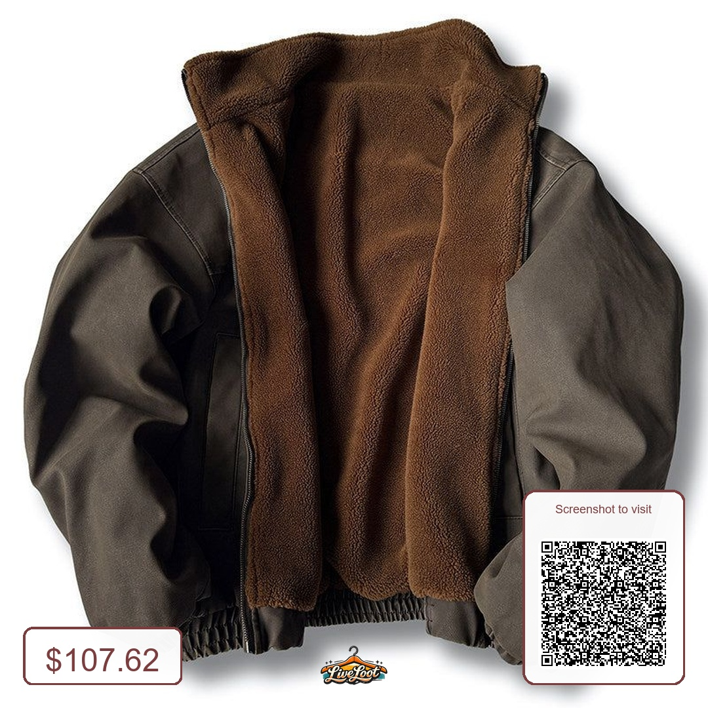
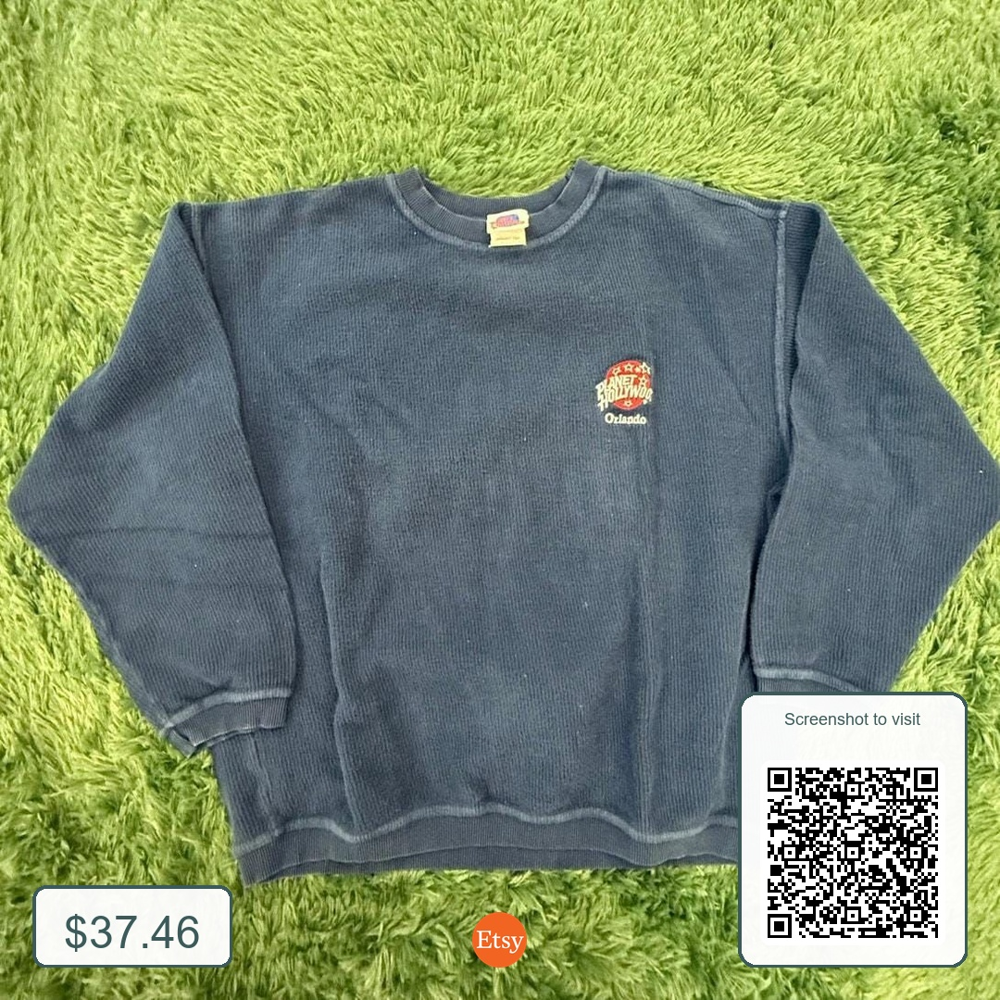
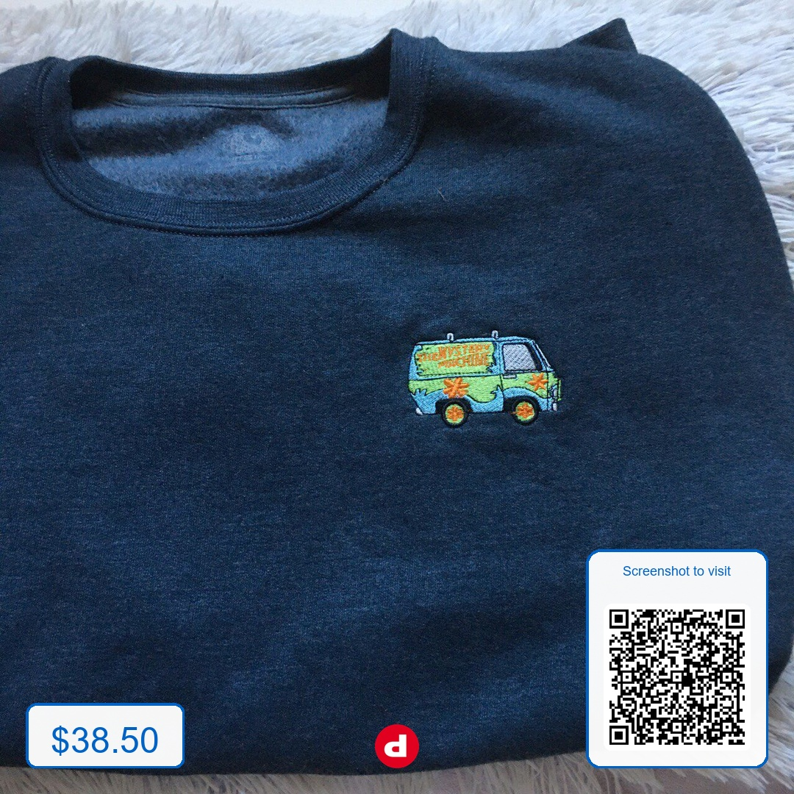

# Instagram Post Generator

Automatically creates Instagram-ready **1080×1080px** product posts from resale listing URLs. Fetches the product image, extracts the price, and adds a price badge, site logo, and scannable QR code — all in one command.

## Examples

| Depop — $38.50 | Etsy — $37.46 | LiveLoot — $107.62 |
|:-:|:-:|:-:|
|  |  |  |

---

## Requirements

```bash
pip install pillow requests beautifulsoup4 selenium qrcode[pil]
```

ChromeDriver is required for sites that use JavaScript rendering (Poshmark, Mercari). Install it matching your Chrome version:

```bash
# macOS
brew install chromedriver

# Windows
choco install chromedriver
```

---

## Usage

### Single URL
```bash
python create_instagram_post.py <url>
```

### Local image + URL
Use this when a site blocks automated scraping (e.g. Etsy). Save the product image manually from your browser, then pass it alongside the URL. The QR code will still point to the listing.
```bash
python create_instagram_post.py product.jpg <url>
```

### Batch from text file
One URL per line. Lines starting with `#` are skipped.
```bash
python create_instagram_post.py links.txt
```

**Example `links.txt`:**
```
# Jackets
https://www.depop.com/products/abc123/
https://www.ebay.com/itm/226424957468
https://poshmark.com/listing/item-id

# Shirts
https://www.mercari.com/us/item/m15360818077/
```

Batch outputs are named `instagram_post_1.jpg`, `instagram_post_2.jpg`, etc. A pass/fail summary prints at the end.

---

## Supported Sites

| Site | Image | Price | Notes |
|------|:-----:|:-----:|-------|
| Depop | ✅ | ✅ | |
| eBay | ✅ | ✅ | |
| Poshmark | ✅ | ✅ | Requires ChromeDriver |
| Mercari | ✅ | ✅ | Requires ChromeDriver |
| Pinterest | ✅ | ✅ | Uses pin image; QR code links to destination listing |
| Etsy | ❌ | ❌ | Blocked by Cloudflare — use local image + URL method |
| Vinted | ✅ | ✅ | |
| Grailed | ✅ | ✅ | |
| Other | ✅ | ⚠️ | Attempts `og:image` and common price selectors |

---

## Output

All images save to the `output/` folder (created automatically).

Each post includes:
- **Product image** — letterboxed to 1:1 with a background colour sampled from the image
- **Price badge** — bottom-left, white rounded box with a colour-matched border
- **Site logo** — bottom-center, transparent PNG at fixed height (width scales naturally)
- **QR code** — bottom-right with "Screenshot to visit" label; always a clean desktop web URL

---

## Logos

Place logo files in a `logos/` folder next to the script. Transparent PNGs work best — they're clipped to a fixed height of 60px with width scaling naturally.

`logos/default.png` is included in this repo and is used for any unrecognised site.

| File | Site |
|------|------|
| `logos/depop.png` | Depop |
| `logos/ebay.png` | eBay |
| `logos/poshmark.png` | Poshmark |
| `logos/etsy.png` | Etsy |
| `logos/pinterest.png` | Pinterest |
| `logos/vinted.png` | Vinted |
| `logos/grailed.png` | Grailed |
| `logos/mercari.png` | Mercari |
| `logos/agedivy.png` | agedivy.com |
| `logos/default.png` | Any unrecognised site — **included in repo** |

To add a new site, add an entry to `SITE_LOGOS` at the top of the script:

```python
SITE_LOGOS = {
    ...
    'newsite.com': 'logos/newsite.png',
}
```

---

## Manual Fix

When a URL fails, the script prompts instead of silently skipping:

```
✗ [3] Error: ...

  Manual fix? (Y/N): y
  Image URL (direct link to the product photo): https://...
  Price (e.g. $24.99, or leave blank to skip): 49
  ✓ Saved: output/instagram_post_3.jpg
```

The QR code always encodes the **original listing URL**, regardless of the image URL you provide. Price accepts bare numbers (`49`, `14.99`) as well as formatted strings (`$49`, `£29.99`, `€15`).

---

## Folder Structure

```
create_instagram_post.py
links.txt                  ← optional batch input
logos/
│   default.png            ← included
│   depop.png
│   ebay.png
│   etsy.png
│   ...
output/
    instagram_post.jpg
    instagram_post_1.jpg
    instagram_post_2.jpg
    ...
```

---

## Notes

- **QR codes** strip all tracking parameters (`utm_*`, `ref`, `fbclid`, etc.) and mobile subdomains (`m.ebay.com` → `www.ebay.com`). App deep-links (`depop.app.link`, `etsy.app.link`, Branch.io, etc.) are followed at runtime and resolved to their final web URL so iOS opens Safari instead of the app.
- **Etsy** QR codes use `etsy.com` without `www` — iOS Universal Links only intercept `www.etsy.com`, so dropping the subdomain forces the browser to open instead of triggering the App Clip error.
- **Pinterest** QR codes link to the destination listing (Depop, eBay, etc.), not the pin. Price is pulled from the pin if present, otherwise fetched from the destination.
- **Price parsing** automatically cleans messy strings — `"Was $66.00 (11% off) -$7.26"` becomes `$58.74`.
